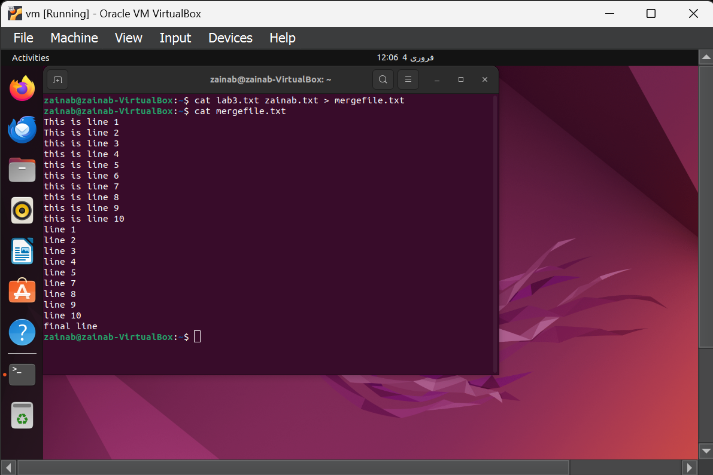

# Lab 3 :-   Linux Commands

## Task 1:

### Q1:  Create a file named “19f-XXXX.txt”. File must contain at least 10 lines.

### Q2: Create another file named “your name.txt”. File must contain at least 10 lines.

### Q3:  Merge the data of both files.

### Q4:  Redirect the output to a new file.

### Q5:  Display the first two lines of first file.

### Q6:  Display the last two lines of second file.

### Q7:  Finds the string (your roll#) from the first file.

### Q8:  Grant the execute permission of the second file to the group.

.png)

### Q9:  Remove the write permission for the owner.

### Q10:  Now Mr. Tom suddenly lost the track of his current location. Help him find his location.

### Q11:  He wants the list of all files present on Desktop directory.

### Q12:  Now he wanted to create a folder of his personal files and pictures named as your roll#.

### Q13:  Display the current time.

### Q14:  .He is done with the task and he is happy with your work. He want to display a thankyou message. 

> [!NOTE]
>
> Task 2

## Task 2

### Q1:  Create a file named “19f-XXXX_OS-lab_rules.txt” using linux commands. The file must contain all lab rules covered in first lab.

### Q2:  You want to set the rights of created file to this (- rwx r-x r--). For these rights, you are required to convert the given rights in numeric format using binary number system procedure covered in lecture. Show complete working.

### Q3:  Now use the derived number to change the permission of a file using chmod command.

### Q4:  Append the output of ls command to created file

